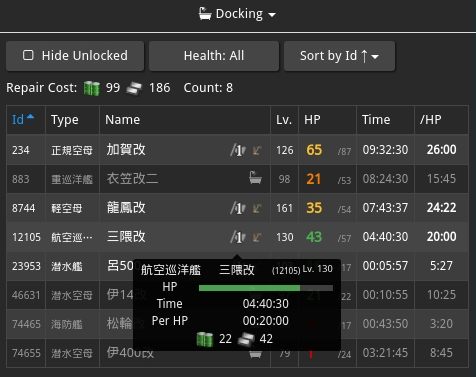

# poi-plugin-docking

This is a [poi](https://github.com/poooi/poi) plugin
for viewing information related to docking and anchorage repair.

Unlike existing plugin [Anchorage repair](https://github.com/poooi/plugin-anchorage-repair),
this plugin focuses more on giving you an overview of all damaged ships and
makes it a bit easier to plan docking & anchorage repair at the same time.

## How to Use & Features

Using it should be straightforward. Feel free to open an issue if not xD.

### Controls

Few simple filters and sorting methods are implemented:

- **Hide Unlocked**: When turned on, ship with heart-locks are excluded from the list.

- **Health**: Health state based filter:

    - **All**: shows all ships regardless of their health state

    - **≤ Minor Dmg**: shows all ships whose health state is better than moderate damaged.
      In other words, this filter gives you ships that can be anchorage-repaired.

    - **> Minor Dmg**: shows all moderate damaged / heavily damaged ships.
      In other words, this filter gives you all ships that cannot be anchorage-repaired

- **Sort by Id / Type / Name / Level / HP / Docking Time / Time per HP**

    - **Time per HP** is the amount of time necessary to recover 1HP when docking
      Note that total docking time is `30 seconds + HP lost * Time per HP`.

    - Selecting the same sorting method causes the order to reverse

    - Table headers are also clickable, which serves the same purpose.

### Simple Mode

If you don't have enough room to show all columns,
you can enable "Simple Mode" through plugin settings:

### Auto Switch

When this plugin is allowed to auto switch,
going to the docking page in game will cause auto-switching to this plugin.

## Changelog

### 0.4.1

- Changelog starts from this version.
- Now counts number of ships listed.
